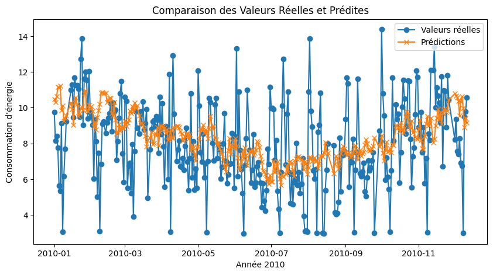

# Household Power Consumption Prediction

  
  

## Authors
- Elias Ben Rhouma
- Gabriel Mercier

## Table of Contents
1. [Introduction](#introduction)
2. [Data Pre-processing](#data-pre-processing)
   - [Dataset Household Power Consumption](#dataset-household-power-consumption)
   - [Dataset Meteorological Data from Météo France](#dataset-meteorological-data-from-météo-france)
3. [Seasonality Detection](#seasonality-detection)
   - [Determination of Number of Clusters](#determination-of-number-of-clusters)
   - [K-means Clustering](#k-means-clustering)
4. [Distribution of Hourly Consumption](#distribution-of-hourly-consumption)
5. [Weather Influence](#weather-influence)
   - [Dataset Fusion](#dataset-fusion)
   - [Pre-processing](#pre-processing)
   - [Regression Models](#regression-models)
   - [Conclusion and Future Work](#conclusion-and-future-work)

## Introduction
Our project aims to evaluate the feasibility of predicting household electricity consumption based on meteorological data. We used two datasets and Python as our programming language due to its extensive machine learning libraries like scikit-learn and pandas. Google Colab was chosen for collaboration.

## Data Pre-processing

### Dataset Household Power Consumption
This dataset includes a variety of data related to domestic electricity consumption of a residence in Sceaux, captured every minute over four years. Initial steps included handling missing values and anomalies using Z-Score calculations.

### Dataset Meteorological Data from Météo France
The second dataset consists of meteorological data from French weather stations. We consolidated data from 2007 to 2010, focusing on station 7149 (Orly). Missing values were managed by removing empty columns and filling gaps with zeros or the most common values.

## Seasonality Detection
We analyzed seasonality in electricity consumption using the K-means algorithm.

### Determination of Number of Clusters
The optimal number of clusters was determined using the elbow method and silhouette score, resulting in two clusters.

### K-means Clustering
K-means clustering revealed distinct summer and winter consumption patterns.

## Distribution of Hourly Consumption
We used the Kolmogorov-Smirnov test to determine if the hourly consumption follows a normal distribution. Histograms and p-values were plotted for different hours.

## Weather Influence
We explored the correlation between weather conditions and energy consumption using regression models.

### Dataset Fusion
Datasets were merged to align time intervals (hourly and daily). Missing data was handled, and the dataset was split into training and testing sets.

### Pre-processing
Further pre-processing involved scaling features and removing incomplete rows.

### Regression Models
We applied ElasticNet, RandomForestRegressor, and PolynomialFeatures regression models. Hyperparameters were optimized using GridSearchCV, with RandomForestRegressor performing best on the MSE metric.

### Conclusion and Future Work
This project involved end-to-end machine learning processes including data pre-processing, feature engineering, model selection, and tuning. Future work could involve using real-time weather data from Météo France's API for real-time consumption predictions.

